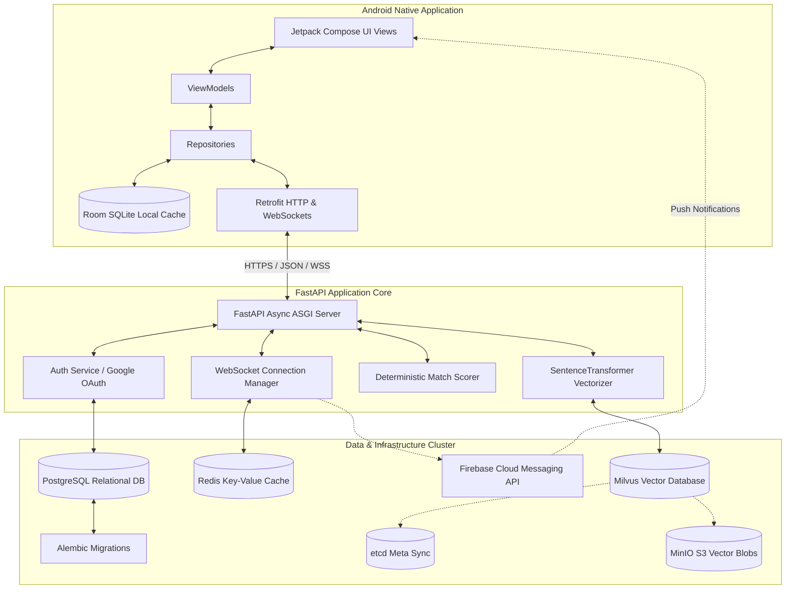

# HiBuddy Full-Stack Study Guide: Master Index & System Architecture

Welcome to the **HiBuddy Full-Stack Developer Study Guide**. This comprehensive guide has been specifically written to prepare you for standard university or academic review sessions, technical interviews, or project defense examinations with your lecturer. 

Each document in this study guide goes beyond showing file names; it dives deep into **why** architectural decisions were made, **how** various components orchestrate to power client-server features, and **what** specific questions your lecturer is highly likely to ask during your examination, complete with professional-grade answers mapping directly to the production code.

---

## 🗺️ Master Study Guide Index

1. **[01. Backend Architecture & Relational Schema](01_backend_architecture_and_models.md)**
   * FastAPI async lifespans & server initialization.
   * SQLAlchemy database models, indices, and core relational schema.
   * OAuth2 credentials flow, Google OAuth provisioning, and custom sliding-window refresh token families with reuse detection.
2. **[02. Hybrid Matching & Semantic Embeddings](02_matching_and_embeddings.md)**
   * The 100-point deterministic multi-criteria scoring algorithm.
   * NLP pipelines using `SentenceTransformer` locally (`all-MiniLM-L6-v2`) to derive 384-dimensional dense vectors.
   * Vector indexing inside Milvus standalone (HNSW with Cosine distance metric) and hybrid query composition.
3. **[03. Real-Time Communication & Chat State Sync](03_realtime_websocket_and_chat.md)**
   * State management via in-memory WebSocket registry (`ConnectionManager`).
   * Dynamic presence lifecycle and subscriber broadcasts (`ws/presence`).
   * Chat network sync: Message deduplication, Delivery/Read statuses, offline queueing, and Firebase Cloud Messaging (FCM) fallbacks.
4. **[04. Android Client Architecture & Offline Cache](04_android_app_architecture.md)**
   * Jetpack Compose state-hoisting, modular screens, and `NavHost` single-activity routing graphs.
   * Custom Dependency Injection (Service Locator pattern) and Repository pattern as the single source of truth.
   * Clean network authentication hooks: Retrofit `AuthInterceptor` and `AuthAuthenticator` token rotation mechanics.
   * Room Local SQLite synchronization for offline-first resilience.
5. **[05. Admin, Moderation, & Trust Systems](05_admin_moderation_and_safety.md)**
   * Project flagging, user-reporting pipelines, and moderation workflows.
   * Secure student academic email verification and administrator moderation portals.
6. **[06. Infrastructure, Seeding, & Testing](06_deployment_seeding_and_testing.md)**
   * Multi-container local environments with Docker Compose (PostgreSQL, Redis, MinIO, etcd, Milvus).
   * Relational data mock-seeding scripts (`seed_data.py`).
   * Pytest-asyncio backend test suites and Compose-based Android instrumented tests.

---

## 🏗️ High-Level System Architecture Diagram

Below is the orchestration topology showing how the Android Mobile App client interacts with the FastAPI backend cluster and the localized micro-services:



---

## 🎓 The Codebase Self-Exploration & Interview Prep Prompt

If you ever need to load this codebase into another session of Claude (or any other advanced LLM) to get a top-down conversational walkthrough, copy and paste the prompt block below. It will configure the LLM to act as a highly strict, academic, and professional full-stack computer science lecturer.

```markdown
You are a highly experienced Full-Stack Mobile Software Architect and a Senior University Computer Science Lecturer. 
I am preparing for an intensive top-down oral project examination/technical interview with my professor based on my project "HiBuddy".

"HiBuddy" is a full-stack platform designed to match university students to collaborative projects, consisting of:
1. An Android Mobile Client: Built in Kotlin, utilizing Jetpack Compose, MVVM Architecture, ServiceLocator, Retrofit, and Room SQLite.
2. An Async Python Backend API: Built in FastAPI, SQLAlchemy (async pg), Alembic, PostgreSQL, Redis, Milvus vector database, SentenceTransformers, and Firebase Cloud Messaging (FCM).

I need you to thoroughly examine my code from the top down and act as my Examiner. Your goal is to prepare me for every single possible curveball, architectural critique, and implementation question my professor might ask me.

### Instructions on how we will interact:
1. Do not give a generic summary. Be highly technical, referencing actual files, classes, endpoints, and architectural principles.
2. Ask me ONE challenging technical question at a time. Do not overwhelm me with a list.
3. The questions must range across different layers:
   - Client-side State Hoisting, recomposition triggers, and Flow emission in Jetpack Compose.
   - Client-side token refreshment handling during race conditions (multi-threading with OkHttp Authenticator/Interceptor).
   - Core relational modeling, database indexing, cascading deletes, and SQLAlchemy async sessions.
   - Real-time connection management via WebSockets, concurrency handling, and Redis state sharing.
   - The math and business logic in our hybrid matching system (deterministic heuristics vs. Milvus vector search queries).
   - Trust, Safety, Moderation workflows, and student verification lifecycle.
4. After I provide my answer, give me:
   - **Grade & Critique**: An honest assessment of my answer (Poor, Fair, Strong, Exceptional) with concrete corrections.
   - **The Ideal Explanation**: The exact response I should have given to the lecturer, referencing the precise files/lines in the codebase so I can point them out.
   - **Next Question**: Move on to a new component of the system.

To get started, introduce yourself as my Examiner, summarize the primary architecture of HiBuddy in one brief paragraph, and ask me your FIRST highly technical question regarding the client or backend!
```

---

*Move on to the next section: **[01. Backend Architecture & Relational Schema](01_backend_architecture_and_models.md)** to begin diving into the FastAPI backend service setup.*
